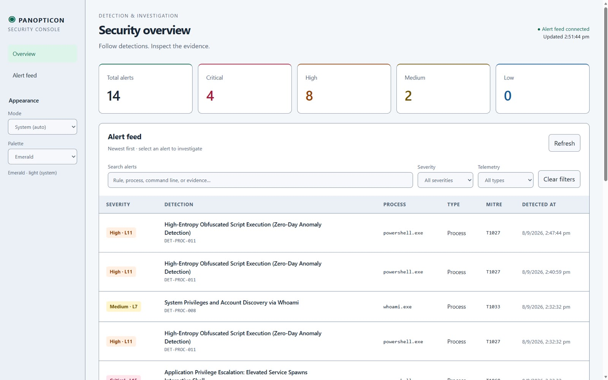

# panopticon-console

Minimal V1 alert viewer for the **Panopticon&Co** EDR platform.

The console reads the Alert NDJSON file that
[`panopticon-detection-engine`](https://github.com/Panopticon-Co/panopticon-detection-engine)
writes via its `--output-file` option and serves it as a single auto-polling
web page, so a human can see that a detection fired.

## Scope (deliberately small)

| Owns | Does **not** own |
|---|---|
| Reading the engine's alert NDJSON | Detection logic |
| Presenting alerts to a human | `Alert` creation / serialization |
| Polling for new alerts | Telemetry collection |
| Displaying Manager's response-action queue (optional, read-only) | Remediation / response, or any decision on it |

The primary integration boundary is **the alert file on disk** for
detection-engine: the console does not import it and makes no network call to
it. Optionally, this server (not the browser) can also poll `panopticon-manager`
over HTTP for a **read-only** view of its response-action approval queue — see
"Response actions (optional)" below. No database, no message queue, no
WebSockets, no browser-facing authentication — none of that is a V1
requirement. It is a local development / demo tool and binds `127.0.0.1` by
default.

## Requirements

Python 3.9+ standard library only. No `pip install`.

## Run

```bash
python app.py --alerts-file /path/to/panopticon-detection-engine/alerts.ndjson
```

Then open <http://127.0.0.1:8787>.

| Flag | Default | Meaning |
|---|---|---|
| `--alerts-file` | *(required)* | Path to the engine's `--output-file`. May not exist yet — the console starts anyway and picks it up once it appears. |
| `--host` | `127.0.0.1` | Bind address. Only widen deliberately. |
| `--port` | `8787` | Bind port. |
| `--manager-url` | *(none)* | Optional `panopticon-manager` base URL. Combined with the `PANOPTICON_MANAGER_TOKEN` environment variable, enables the read-only response-actions panel. |

### HTTP surface

| Route | Response |
|---|---|
| `GET /` | The viewer page (`static/index.html`). |
| `GET /app.js` | The client script. |
| `GET /api/alerts` | `application/json` array of alert objects, in file order. Missing / unreadable file → `[]`. Malformed lines are skipped. |
| `GET /api/response-actions` | Same-origin proxy to Manager's `GET /api/v1/response-actions`, read-only. `503` if `--manager-url`/`PANOPTICON_MANAGER_TOKEN` aren't both configured; `502` if Manager can't be reached; otherwise Manager's own status and body, passed through verbatim. |

The page polls `/api/alerts` every 3 seconds and shows timestamp, rule ID,
severity + Wazuh level, MITRE tactic/technique, title, and the evidence
key/value pairs. Rows whose `alert_id` was not present on the previous poll
flash briefly.

### Live runs (detection-engine V2)

The detection engine's V2 `--reliable` pipeline appends each alert to its
`--output-file` the moment it is generated (`IncrementalAlertWriter`), instead
of one dump at stream end. No console change is required for this — `read_alerts`
already returns the file as it has grown so far and skips a half-written final
line, so every poll picks up new alerts while the engine is still running. Point
`--alerts-file` at the engine's `--output-file` and leave both running.

`static/app.js` de-duplicates by `alert_id` before rendering, so if the engine
ever re-appends an already-delivered alert (e.g. a restart racing its own
delivery ack) the browser shows it once. The `/api/alerts` API itself is
unchanged: it passes every line through untouched.

## Response actions (optional)

Set `--manager-url` and the `PANOPTICON_MANAGER_TOKEN` environment variable
(an analyst bearer token, see `panopticon-manager`'s
`POST /api/v1/analysts/enroll`) to show a read-only "Response actions" panel
alongside the alert feed. The analyst token is a **server-side** secret: this
console's own Python process attaches it to its outbound call to Manager,
and the browser only ever talks to this console, same-origin
(`GET /api/response-actions`) — it never receives the token and never calls
Manager directly. The console's existing `Content-Security-Policy`
(`connect-src 'self'`) is unchanged. Authorizing or rejecting a pending
response action is intentionally **not** exposed here — that stays a direct
analyst action against Manager (e.g. `curl -H "Authorization: Bearer $TOKEN"
-X POST https://manager.example/api/v1/response-actions/<id>/authorize`),
consistent with this console never gaining a route that mutates anything.

## Security notes

- Alert evidence carries attacker-influenced strings (process command lines).
  The client writes every value to the DOM via `textContent` — never
  `innerHTML` string-building — and the server sends
  `Content-Security-Policy: default-src 'none'; script-src 'self'; …` plus
  `X-Content-Type-Options: nosniff` as a second layer.
- Only the four routes above resolve. There is no filesystem path mapping, so
  request paths cannot be turned into arbitrary file reads.
- Default bind is localhost. There is no browser-facing auth because there is
  nothing multi-user about a local demo; do not add one to paper over
  exposing it. The optional Manager analyst token is a server-side secret
  (an environment variable), never a browser credential.

## Test

```bash
python -m unittest discover -s tests
```

Unit tests (`tests/test_read_alerts.py`) cover NDJSON parsing: missing/empty
file, blank lines, malformed and truncated lines, non-object JSON, ordering,
and the display-field contract with the engine's `Alert.to_dict()`.
HTTP tests (`tests/test_http.py`) start a real server on an ephemeral port and
check the static routes, security headers, 404s, `HEAD`, the `/api/alerts`
payload and field set, live reflection of file updates, injection-payload
pass-through, and that two servers serve their own distinct `--alerts-file`.
`tests/test_response_actions_proxy.py` covers `/api/response-actions`: 503
when Manager isn't configured, 502 when it's unreachable, Manager's own
status/body passed through verbatim, and that the analyst token never
appears in what the browser receives. `tests/test_response_panel.cjs`
(Node) exercises the client-side panel against a mocked `fetch`.

## The full V1 demonstration

See [`docs/PANOPTICON_V1.md`](docs/PANOPTICON_V1.md) for the end-to-end
walkthrough: real Windows process creation → Officer (ETW/Sysmon) →
Schema 0.2 → detection engine → `DET-PROC-011` → `alerts.ndjson` → this console.

## Dashboard



### Appearance and theme tokens

Use Appearance in the sidebar to choose Emerald, Ocean, Violet, or Amber and
Dark, Light, or System (auto). System is the default and follows OS changes live.
Preferences persist in this browser and synchronize across tabs. If browser
storage is unavailable, changes still work for the current session.

The theme engine at the top of `static/app.js` centralizes semantic color tokens as hex values. Components
consume CSS custom properties such as `--panel`, `--text`, and `--accent`.
Add palettes to its `palettes` registry: each mode provides accent, active
background, and new-alert flash colors. Severity colors are shared per mode.
The head script applies preferences before rendering to avoid a theme flash.

The theme engine uses the existing `/app.js` route, so a browser refresh is
sufficient even when the console server is already running. Run `node tests/test_theme.cjs` for theme behavior and
text-contrast checks across all eight palette/mode combinations.

The local console includes severity totals, full-text search across alert fields,
severity and telemetry-family filters, and a newest-first feed with 25 alerts per
page. Select a detection title to open its evidence and MITRE details. Close the
panel with the Close button or Escape.

The feed refreshes every three seconds and retains the last received alerts if
connection fails. Counts cover all loaded, deduplicated alerts, independently of
filters. Feed connectivity does not indicate collector health. The console still
reads the engine's existing alert file; no additional Python packages are needed.

After updating the static files, refresh the browser at http://127.0.0.1:8787.
There is no server restart required for these dashboard changes.

Dashboard interaction checks (optional Node.js, run from this directory):

```sh
node tests/test_dashboard.cjs
```

These checks exercise the client with a minimal DOM model, including filters,
pagination, deduplication, detail values, and connection failure/recovery. They
are not browser layout tests.

## Stack

Python 3 standard library only on the server (`app.py`, `http.server`) — no
framework, no `pip install`, no `package.json`. The client is vanilla HTML/CSS/
JavaScript (`static/index.html`, `static/app.js`) served directly, with no
build step. Node.js is used only to run the `.cjs` test scripts in `tests/`
(`node --check`, no npm dependencies) — this is **not** a Next.js/React/
TypeScript project.

## What this is not (yet)

To be explicit about scope rather than implying more than exists: there is no
browser-facing authentication, no database, no WebSockets, and no route that
mutates state (authorizing/rejecting a response action is deliberately not
exposed here — see "Response actions (optional)" above). This is a local
development/demo viewer, not a multi-user production console.

## Contributing / Security / License

- See `CONTRIBUTING.md` for development setup.
- See `SECURITY.md` for vulnerability reporting.
- See `CODE_OF_CONDUCT.md` for community standards.
- Licensed under the [MIT License](LICENSE).

## Integration with other Panopticon repos

- [`panopticon-manager`](https://github.com/Panopticon-Co/panopticon-manager) — optional read-only response-actions source (see "Response actions (optional)" above).
- [`panopticon-detection-engine`](https://github.com/Panopticon-Co/panopticon-detection-engine) — writes the alert NDJSON file this console reads.
- [`panopticon-agent`](https://github.com/Panopticon-Co/panopticon-agent) / [`panopticon-linux-agent`](https://github.com/Panopticon-Co/panopticon-linux-agent) — upstream telemetry producers, not integrated directly with this console.
- [`panopticon-contracts`](https://github.com/Panopticon-Co/panopticon-contracts) — canonical wire contracts used elsewhere in the pipeline.
- [Panopticon-Co](https://github.com/Panopticon-Co) — organization home.
